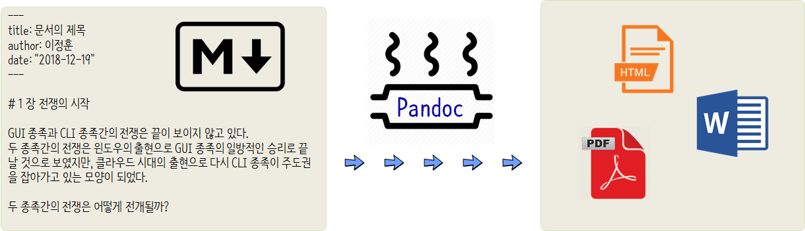
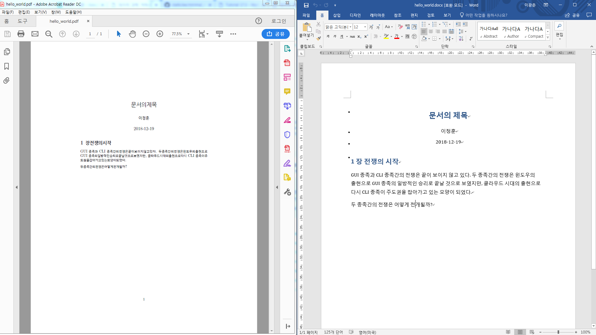

``` {r, include=FALSE}
# source("tools/chunk-options.R")
knitr::opts_chunk$set(echo = TRUE, warning=FALSE, message=FALSE,
                    comment="", digits = 3, tidy = FALSE, prompt = FALSE, fig.align = 'center')

```


# 자동화 툴체인 구축  [^rmarkdown-paper] [^author-carpentry] [^swcarpentry-sheffield] [^minial-make] {#basic-structure}

[^rmarkdown-paper]: [Daijiang Li(2017/04/05), "Writing Academic Papers with Rmarkdown"](https://daijiang.name/en/2017/04/05/writing-academic-papers-with-rmarkdown/)

[^author-carpentry]: [Gail Clement, Tom Morrell, "Reproducible Research Reporting with R and RStudio"](https://authorcarpentry.github.io/executable-documents-rstudio/)

[^minial-make]: [Karl Broman, "minimal make A minimal tutorial on make"](http://kbroman.org/minimal_make/)

[^swcarpentry-sheffield]: [Software Carpentry @ University of Sheffield](https://rgaiacs.gitlab.io/2018-11-07-intermediate-shell-sheffield/)


## `make` 설치  {#basic-structure-make}

윈도우 환경 make는 [Make for Windows](http://gnuwin32.sourceforge.net/packages/make.htm)에서 모든 것이 포함된
`make-3.81.exe` 파일을 다운로드 받아 설치하면된다. 윈도우 환경에서 `make`를 실행할 경우 ...

- [내컴퓨터 - 속성] 또는 [제어판\시스템 및 보안\시스템] 에서 왼쪽의 '고급 시스템 설정' 으로 들어갑니다.
    - 혹은 Windows 설정에서 "설정 찾기" 검색창에 '고급 시스템 설정'을 입력합니다.
- 시스템 속성 창입니다. '환경 변수' 클릭
- 시스템 변수의 '새로 만들기' 를 클릭하여 시스템 변수를 추가하거나, 사용자 변수에 추가합니다.
- `make -version` 명령어를 임의 디렉토리에서 타이핑하게 되면 `make`가 정상 동작하는 것을 확인할 수 있습니다.


```{r make-setup, eval=FALSE}
# C:\Users\rstudio>make -version
# GNU Make 3.81
# Copyright (C) 2006  Free Software Foundation, Inc.
# This is free software; see the source for copying conditions.
# There is NO warranty; not even for MERCHANTABILITY or FITNESS FOR A
# PARTICULAR PURPOSE.
# 
# This program built for i386-pc-mingw32
```

## $LaTeX$ 설치  {#basic-structure-latex}

윈도우 환경에서 한글이 지원되는 환경을 구축한다는 것은 영문으로 구현하는 것과 전혀 다른 얘기가 될 수 있다. 한글 윈도우 10 환경에서 한글 $LaTeX$ 환경설정에 대한 자세한 사항은 다음 링크를 참조한다.

[데이터 과학: 저작(Authoring) - 한글 LaTeX 윈도우 설치](https://statkclee.github.io/ds-authoring/latex-install-windows.html)


## `pandoc` 설치 {#basic-structure-pandoc}

[`pandoc`](https://pandoc.org)은 하스켈(haskell) 언어로 만들어진 문서 변환 프로그램으로 "Pandoc: a universal document converter"로 영미권에서 폭넓게 활용되고 있다.
`pandoc`은 마크다운 등을 입력으로 받아 이를 다양한 형태 문서로 변환시키는 도구다.

+---------------------+--------+--------------------+
|      입력형식       | &rarr; |   출력형식         |
+=====================+========+====================+
| - HTML              |        | - plain text    |
| - LaTeX             |        | - markdown    |
| - Textile           |        | - HTML (XHTML, HTML5>)    |
| - reStructuredText  |        | - LaTeX    |
| - MediaWiki Markup  |        | - PDF (when LaTeX installed)    |
| - DocBook XML       |        | - Various HTML/Javascrip based slide shows    |
| - 마크다운          |        | - EPUB    |
|                     |        | - Emacs org-mode    |
|                     |        | - Rich Text Format (RTF)    |
|                     |        | - OpenDocument XML    |
|                     |        | - LibreOffice (Open Document Format, ODT)    |
|                     |        | - Microsoft Word DOCX    |
|                     |        | - MediaWiki markup    |
|                     |        | - FictionBook2    |
|                     |        | - Textile    |
|                     |        | - groff man pages    |
|                     |        | - AsciiDoc    |
+---------------------+--------+--------------------+

[Installing pandoc](https://pandoc.org/installing.html) 사이트에서 다운로드 받아 각 환경에 맞춰 설치작업을 수행하면 된다.

```{r pandon-install, eval=FALSE}
$ pandoc --version
pandoc.exe 1.19.2.1
Compiled with pandoc-types 1.17.0.4, texmath 0.9, skylighting 0.1.1.4
Default user data directory: C:\Users\chongmu\AppData\Roaming\pandoc
Copyright (C) 2006-2016 John MacFarlane
Web:  http://pandoc.org
This is free software; see the source for copying conditions.
There is no warranty, not even for merchantability or fitness
for a particular purpose.
```

# `pandoc` 기반 문서작성 [^pandoc-hello-world] {#basic-structure-pandoc-hello-world}

[^pandoc-hello-world]: [Tutorial 17.3 - Markdown and Pandoc](http://www.flutterbys.com.au/stats/tut/tut17.3.html)


`pandoc`으로 문서를 작성할 경우 다양한 입력형식이 제공되지만, 일반적으로 **마크다운(markdown)**으로 문서를 저작하고 
이를 `pandoc` 엔진으로 다양한 형태 문서로 뽑아내는 과정을 거친다.



`hello_world.md` 마크다운 문서를 작성한 후에 `pandoc -o output.file input.file` 형태로 명령어를 전달시키면 워드문서, pdf 문서, html 문서를 자동으로 변환시켜 생성시킬 수 있다.

마크다운 문서 작성에 필요한 기본 문법에 대해서는 다음 웹사이트를 참조한다.

- [마크다운 기초](http://statkclee.github.io/modern-scientific-authoring/02-markdown-kr.html)

["소프트웨어에 물들다"(2018-05-26)](http://somul.kr/) 왕곡초등학교에서 발표한 내용도 참고한다.

- [글쓰기를 잘하기 위해서 알아야 되는 코딩](https://statkclee.github.io/ds-authoring/somul_20180525.html)


<div class = "row">
  <div class = "col-md-6">

**`hello_world.md` 마크다운 문서 작성**

```{r pandon-compose, eval=FALSE}
---
title: 문서의 제목
author: 이정훈
date: "2018-12-19"
---

# 1 장 전쟁의 시작

GUI 종족과 CLI 종족간의 전쟁은 끝이 보이지 않고 있다.
두 종족간의 전쟁은 윈도우의 출현으로 GUI 종족의 일방적인 승리로 끝날 것으로 보였지만,
클라우드 시대의 출현으로 다시 CLI 종족이 주도권을 잡아가고 있는 모양이 되었다.

두 종족간의 전쟁은 어떻게 전개될까?
```

  </div>
  <div class = "col-md-6">


**`hello_world.md` 컴파일 &rarr; `hello_world.html`**

```{r pandon-install-compile, eval=FALSE}
$ pandoc -o hello_world.html hello_world.md
$ pandoc -o hello_world.docx hello_world.md
$ pandoc -o hello_world.pdf hello_world.md --latex-engine=xelatex -V CJKmainfont="NanumGothic"
$ ls
hello_world.docx  hello_world.pdf  hello_world.html  hello_world.md
$ cat hello_world.html
<h1 id="장-전쟁의-시작">1 장 전쟁의 시작</h1>
<p>GUI 종족과 CLI 종족간의 전쟁은 끝이 보이지 않고 있다. 두 종족간의 전쟁은 윈도우의 출현으로 GUI 종족의 일방적인 승리로 끝날 것으로 보였지만, 클라우드 시대의 출현으로 다시 CLI 종족이 주도권을 잡아가고 있는 모양이 되었다.</p>
<p>두 종족간의 전쟁은 어떻게 전개될까?</p>
```

  </div>
</div>




영문기반 `pandoc`과는 별개로 한글로 문서를 작성할 경우 추가 작업이 필요한데 pdf 파일 변환의 경우 $LaTeX$엔진설정과 폰트 설정을 통해
한글도 문제없이 다양한 형태로 변환이 가능하다. 

<style>
div.blue { background-color:#e6f0ff; border-radius: 5px; padding: 10px;}
</style>
<div class = "blue">

**`pdf` 문서 변환시 CJK 문제 해결방법** [^cjk-pandoc]

[^cjk-pandoc]: [stackoverflow - "Pandoc and foreign characters"](https://stackoverflow.com/questions/18178084/pandoc-and-foreign-characters)

한국어가 포함된 CJK 문제에 대해서 $LaTeX$엔진을 `--latex-engine=xelatex`으로 지정하고, CJK 글꼴로 
`-V CJKmainfont="NanumGothic"`을 지정하면 해결이 된다.

`pandoc -o hello_world.pdf hello_world.md --latex-engine=xelatex -V CJKmainfont="NanumGothic"`
</div>


# $LaTeX$ 기반 논문작성  {#basic-structure-latex-make}

가장 먼저 $LaTeX$ 기반 논문작성을 위해서 [Karl Broman, "minimal make A minimal tutorial on make"](http://kbroman.org/minimal_make/)을 참조하여 데이터 과학자에 적합한 형태로 변형을 시켜본다. 그리고 마크다운으로 확장하고, R 마크다운으로 확장하여 RStudio IDE에서 통합작업이 가능하게 작업한다. [^keran-healy-pandoc]

[^keran-healy-pandoc]: [Kieran Healyn (2018-04-28), "The Plain Person's Guide to Plain Text Social Science"](http://plain-text.co/)


