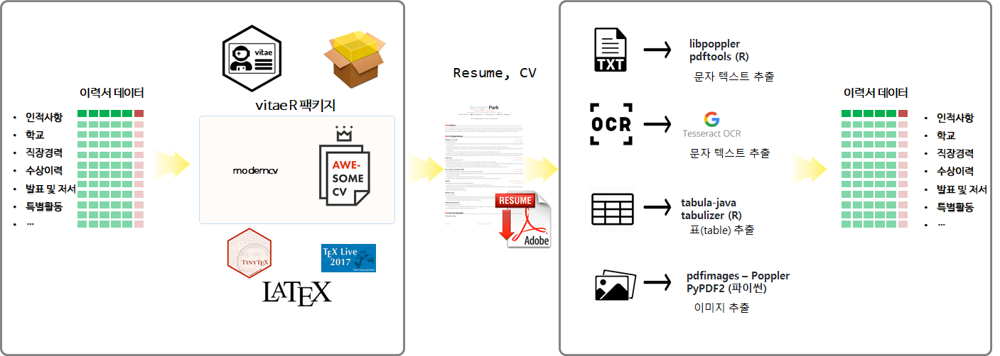

``` {r, include=FALSE}
# source("tools/chunk-options.R")
knitr::opts_chunk$set(echo = TRUE, warning=FALSE, message=FALSE,
                    comment="", digits = 3, tidy = FALSE, prompt = FALSE, fig.align = 'center')

```


개괄적인 작업흐름은 데이터프레임 정형데이터에서 `pandoc` 계열 도구와 마크다운, $LaTex$ 언어 등을 활용 다양한 문서를 만들어내는 것이고 이렇게 다양한 문서 데이터를 다시 다양한 도구와 방법론을 사용해서 정형데이터로 만들어 낸다.



# 이력서 PDF 데이터 {#pdf-to-dataframe-data}

예제 데이터로 공개된 영문 [Awesome CV is LaTeX template for your outstanding job application](https://github.com/posquit0/Awesome-CV) PDF 파일을 사용한다.


<div class = "row">
  <div class = "col-md-6">
**첫번째 페이지**

```{r pdf-png}
library(pdftools)
library(magick)

resume_first_png <- pdf_render_page("data/resume.pdf", page = 1, dpi = 300, numeric = FALSE)
image_read(resume_first_png)
```

  </div>
  <div class = "col-md-6">
**두번째 페이지**

```{r pdf-png-resume}
resume_second_png <- pdf_render_page("data/resume.pdf", page = 2, dpi = 300, numeric = FALSE)
image_read(resume_second_png)
```

  </div>
</div>

# PDF &rarr; 데이터프레임 {#pdf-to-dataframe}

반정형 이력서 PDF 파일에서 데이터프레임을 추출한다. 

## 데이터 구분 {#pdf-to-dataframe-section}

```{r read-pdf-section}
library(pdftools)
library(tidyverse)

cv_dat <- pdf_text("data/resume.pdf")

cv_dat <- paste0(unlist(cv_dat), collapse = "")

cv_split_dat <- cv_dat %>% 
  str_split(pattern="\r\n") %>% 
  .[[1]]

# 인적사항 -------------------
`인적사항_idx` <- cv_split_dat %>% 
  str_detect("Summary") %>% 
  which(TRUE)

인적사항 <- cv_split_dat[1:(`인적사항_idx`-1)]

# 요약("Summary") -------------------
`요약_idx` <- cv_split_dat %>% 
  str_detect("Work Experience") %>% 
  which(TRUE)

요약 <- cv_split_dat[(`인적사항_idx`+1):(`요약_idx`-1)]

# 직장경력("Work Experience") -------------------
`직장경력_idx` <- cv_split_dat %>% 
  str_detect("Honors & Awards") %>% 
  which(TRUE)

직장경력 <- cv_split_dat[(`요약_idx`+1):(`직장경력_idx`-1)]

# 수상이력 ("Honors & Awards") -------------------
`수상이력_idx` <- cv_split_dat %>% 
  str_detect("Presentation") %>% 
  which(TRUE)

수상이력 <- cv_split_dat[(`직장경력_idx`+1):(`수상이력_idx`-1)]

# 발표("Presentation") -------------------
`발표_idx` <- cv_split_dat %>% 
  str_detect("Writing") %>% 
  which(TRUE)

발표 <- cv_split_dat[(`수상이력_idx`+1):(`발표_idx`-1)]

# 저서("Writing") -------------------
`저서_idx` <- cv_split_dat %>% 
  str_detect("Program Committees") %>% 
  which(TRUE)

저서 <- cv_split_dat[(`발표_idx`+1):(`저서_idx`-1)]

# 심사("Program Committees") -------------------
`심사_idx` <- cv_split_dat %>% 
  str_detect("Education") %>% 
  which(TRUE)

심사 <- cv_split_dat[(`저서_idx`+1):(`심사_idx`-1)]

# 학교("Education") -------------------
`학교_idx` <- cv_split_dat %>% 
  str_detect("Extracurricular") %>% 
  which(TRUE)

학교 <- cv_split_dat[(`심사_idx`+1):(`학교_idx`-1)]

# 특활활동("Extracurricular") -------------------
특활활동 <- cv_split_dat[(`학교_idx`+1):length(cv_split_dat)]

## 이력서 구분

cv_section_list <- list("인적사항" = 인적사항,
     "요약" = 요약,
     "직장경력" = 직장경력,
     "수상이력" = 수상이력,
     "발표" = 발표,
     "저서" = 저서,
     "심사" = 심사,
     "학교"=학교, 
     "특활활동"=특활활동)

listviewer::jsonedit(cv_section_list)
```

## 데이터 정형화 {#pdf-to-dataframe-section-df}

### 인적사항 {#pdf-to-dataframe-section-df-demo}

```{r read-pdf-section-df-demo}
인적사항 <- str_trim(인적사항) %>% str_remove_all(pattern="\uf10b|\uf0e0|\uf015|\uf092|\uf08c")

이름 <- 인적사항[1]
직무 <- 인적사항[2]
주소 <- 인적사항[3]

개인정보 <- str_split(인적사항[4], " \\| ") %>% .[[1]]
전화번호 <- str_trim(개인정보[1])
전자우편 <- str_trim(개인정보[2])
홈페이지 <- str_trim(개인정보[3])
GitHub   <- str_trim(개인정보[4])
링크트인 <- str_trim(개인정보[5])

인적사항_df <- tibble(
  "이름" = 이름,
  "직무" = 직무,
  "주소" = 주소,
  "전화번호" = 전화번호,
  "전자우편" = 전자우편,
  "홈페이지" = 홈페이지,
  "Github"   = GitHub,
  "링크트인" = 링크트인
) 

인적사항_df %>% 
  DT::datatable()
```

### 요약 {#pdf-to-dataframe-section-df-summary}

```{r read-pdf-section-df-summary}
요약_df <- tibble(
  "요약" = str_c(요약, collapse=" ")
)
요약_df %>% 
  DT::datatable()
```

### 직장경력 {#pdf-to-dataframe-section-df-career}

```{r read-pdf-section-df-career}
직장 <- 직장경력[str_detect(직장경력, "S.Korea")]

직장명 <- str_extract(직장, "^(.*?)[\\s+]{2}") %>% 
  str_trim()
근무지 <- str_remove(직장, "^(.*?)[\\s+]{2}") %>% 
  str_trim()

근무연도 <- 직장경력[str_detect(직장경력, "[A-Z]{1}[a-z]{2}.\\s[0-9]{4}")]

역할     <- str_extract(근무연도, "^(.*?)[\\s+]{2}")
근무기간 <- str_remove(근무연도, "^(.*?)[\\s+]{2}") %>% 
  str_trim

직장_df <- tibble(
  "직장명" = 직장명,
  "근무지" = 근무지,
  "역할" = 역할,
  "근무연도" = 근무연도
)

직장_df %>% 
  DT::datatable()
```

### 수상이력 {#pdf-to-dataframe-section-df-win}

```{r read-pdf-section-df-win}

수상 <- 수상이력[str_detect(수상이력, "^\\s+[0-9]{4}" )]

수상년도 <- map_chr(수상, str_extract, "[0-9]{4}")

수상등수 <- map_chr(수상, str_remove, "[0-9]{4}") %>% 
  map_chr(str_trim) %>% 
  map_chr(str_extract, "^(.*?),")

수상프로그램 <- map_chr(수상, str_remove, "[0-9]{4}") %>% 
  map_chr(str_trim) %>% 
  map_chr(str_remove, "^(.*?),") %>% 
  map_chr(str_extract, "^(.*?)[\\s+]{2}") %>% 
  map_chr(str_trim)

수상지역 <- map_chr(수상, str_remove, "[0-9]{4}") %>% 
  map_chr(str_trim) %>% 
  map_chr(str_remove, "^(.*?),") %>% 
  map_chr(str_remove, "^(.*?)[\\s+]{2}") %>% 
  map_chr(str_trim)

수상_df <- tibble(
  "수상년도" = 수상년도,
  "수상등수" = 수상등수,
  "수상프로그램" = 수상프로그램,
  "수상지역" = 수상지역
)

수상_df %>% 
  DT::datatable()
```


### 발표 {#pdf-to-dataframe-section-df-presentation}

```{r read-pdf-section-df-presentation}
발표제목 <- 발표[str_detect(발표, "Korea")]
발표일 <- 발표[str_detect(발표, "[0-9]{4}")]

발표제목 <- map_chr(발표제목, str_extract, "^(.*?)[\\s+]{2}") %>% 
  map_chr(str_trim)

발표일 <- map_chr(발표일, str_remove, "^(.*?)[\\s+]{2}") %>% 
  map_chr(str_trim)

발표_df <- tibble(
  "발표제목" = 발표제목,
  "발표일"   = 발표일
)

발표_df %>% 
  DT::datatable()
```


### 저서 {#pdf-to-dataframe-section-df-book}

```{r read-pdf-section-df-book}
저서명 <- str_extract(저서[1], "^(.*?)[\\s+]{2}") %>% 
  str_trim

저자명 <- str_extract(저서[2], "^(.*?)[\\s+]{2}") %>% 
  str_trim

저작연도 <- str_remove(저서[2], "^(.*?)[\\s+]{2}") %>% 
  str_trim

저서_df <- tibble(
  "저서명" = 저서명,
  "저자명" = 저자명,
  "저작연도" = 저작연도
)

저서_df %>% 
  DT::datatable()
```

### 심사 {#pdf-to-dataframe-section-df-program}

```{r read-pdf-section-df-program}
심사년도 <- map_chr(심사, str_trim) %>% map_chr(., str_extract, "^[0-9]{4}")

심사정보 <- map_chr(심사, str_trim) %>% map_chr(., str_remove, "^[0-9]{4}") %>% 
  str_split(",") %>% 
  map(., str_trim) 

심사역할 <- map_chr(심사정보, 1)
심사프로그램 <- map_chr(심사정보, 2) %>% 
  map_chr(str_extract, "^(.*?)[\\s+]{2}") %>% 
  map_chr(str_trim)

심사지역 <- map_chr(심사정보, 2) %>% 
  map_chr(str_remove, "^(.*?)[\\s+]{2}") %>% 
  map_chr(str_trim)

심사_df <- tibble(
  "심사년도" = 심사년도,
  "심사역할" = 심사역할,
  "심사프로그램" = 심사프로그램,
  "심사지역" = 심사지역
)

심사_df %>% 
  DT::datatable()
```


### 학교 {#pdf-to-dataframe-section-df-education}

```{r read-pdf-section-df-education}
학교임시 <- str_split(학교[1], "    ")

학교임시 <- 학교임시[[1]][학교임시[[1]] != ""]

학교명   <- 학교임시[1]
학교위치 <- 학교임시[2]

학교_df <- tibble(
  "학교명" = 학교명,
  "학교위치" = 학교위치
)

학교_df %>% 
  DT::datatable()
```


### 특활활동 {#pdf-to-dataframe-section-df-extra}

```{r read-pdf-section-df-extra}
특활활동

특활 <- 특활활동[str_detect(특활활동, "S.Korea")]

특활명 <- str_extract(특활, "^(.*?)\\s{2}") %>% 
  str_trim
특활지역 <- str_remove(특활, "^(.*?)\\s{2}") %>% 
  str_trim

특활연도 <- 특활활동[str_detect(특활활동, "[A-Z]{1}[a-z]{2}.\\s[0-9]{4}")]

특활역할  <- str_extract(특활연도, "^(.*?)[\\s+]{2}") %>% str_trim
특활기간 <- str_remove(특활연도, "^(.*?)[\\s+]{2}") %>% 
  str_trim

특활_df <- tibble(
  "특활명" = 특활명,
  "특활지역" = 특활지역,
  "특활역할" = 특활역할,
  "특활기간" = 특활기간
)

특활_df %>% 
  DT::datatable()
```

### 데이터 저장 {#pdf-to-dataframe-section-df-save}

```{r dataframe-save}
인적사항_df %>% write_rds("data/인적사항_df")
요약_df %>% write_rds("data/요약_df")
직장_df %>% write_rds("data/직장_df")
수상_df %>% write_rds("data/수상수상_df")
발표_df %>% write_rds("data/발표_df")
저서_df %>% write_rds("data/저서_df")
심사_df %>% write_rds("data/심사_df")
학교_df %>% write_rds("data/학교_df")
특활_df %>% write_rds("data/특활_df")
```

## 정형 데이터 {#pdf-to-dataframe-done}

```{r normalized-dataset}
resume_df <- tibble(
  "인적사항" = list(인적사항_df),
  "요약" = list(요약_df),
  "직장" = list(직장_df),
  "수상" = list(수상_df),
  "발표" = list(발표_df),
  "저서" = list(저서_df),
  "심사" = list(심사_df),
  "학교" = list(학교_df),
  "특활" = list(특활_df)
)

resume_df %>% 
  DT::datatable()  

resume_df %>% 
  write_rds("data/resume_df.rds")
```

