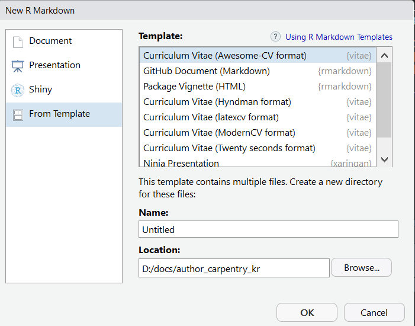

``` {r, include=FALSE}
# source("tools/chunk-options.R")
knitr::opts_chunk$set(echo = TRUE, warning=FALSE, message=FALSE,
                    comment="", digits = 3, tidy = FALSE, prompt = FALSE, fig.align = 'center')

```


# 이력서 PDF 데이터 [^resume-pdf] {#pdf-to-dataframe-data}

[^resume-pdf]: [데이터 사이언스: 저작(Authoring), "이력서(Resume)"](https://statkclee.github.io/ds-authoring/ds-resume.html)

[`vitae`](https://github.com/ropenscilabs/vitae) 팩키지를 설치하고 앞서 추출한 데이터프레임을 바탕으로 이력서 PDF 파일을 제작한다. 먼저 앞서 PDF 이력서에서 추출한 정형 데이터를 확인한다. 
PDF 이력서에서 텍스트를 추출하여 정형데이터로 제작하는 것은 [데이터 과학: 재현가능한 저작
영문 이력서: DF &rarr; PDF &rarr; DF](df-pdf-df.html) 웹사이트를 참고한다.

```{r resume-pdf-vitae}
library(tidyverse)

resume_df <- readRDS("data/resume_df.rds")
resume_df
```

# 이력서 제작 {#pdf-to-dataframe-authoring}

[`vitae`](https://github.com/ropenscilabs/vitae) 팩키지를 설치하면 이력서 제작 템플릿이 자동으로 설치된다. 이를 바탕으로 이력서를 제작하려면 `File` &rarr; `New File` &rarr; `R Markdown` 을 선택하고 **Curriculum Vitae (Awesome-CV format)** 을 선택한다.



R마크다운 YAML 헤더에 기본 인적사항을 기술한다.

```{r resume-yaml, eval=FALSE}
---
name: Byungjin
surname: Park
position: "Software Architect, Security Expert"
address: "42-8, Bangbae-ro 15-gil, Seocho-gu, Seoul, 00681, Rep. of KOREA"
phone: (+82) 10-9030-1843
www: www.posquit0.com
email: "posquit0.bj@gmail.com"
twitter: posquit0
github: posquit0
linkedin: posquit0
date: "`r format(Sys.time(), '%B %Y')`"
output: vitae::awesomecv
editor_options:
  chunk_output_type: console
---
```


이력서에 크게 자유기술하는 경우와 데이터프레임에서 칼럼을 뽑아내서 이를 $\LaTeX$에 넘기는 두가지 경우로 나눠 이력서를 작성한다.

<div class = "row">
  <div class = "col-md-6">
**텍스트 기술**

```{r resume-summary, eval=FALSE}
resume_df %>% 
  select(요약) %>% 
  unnest() %>% 
  brief_entries(요약)
```

  </div>
  <div class = "col-md-6">
**데이터프레임**


```{r vitae-work, eval=FALSE}
resume_df %>% 
  select(직장) %>% 
  unnest() %>% 
  detailed_entries(with=직장명, where=근무지, what=역할, when=근무연도)
```

  </div>
</div>


## 이력서 제작 코드 {#pdf-to-dataframe-authoring-code}

이력서 제작 전체 R마크다운 파일은 [이력서](resume/resume.Rmd) 파일을 다운로드 받아볼 수 있다.

```{r resume-code, eval=FALSE}
# ---
# name: Byungjin
# surname: Park
# position: "Software Architect, Security Expert"
# address: "42-8, Bangbae-ro 15-gil, Seocho-gu, Seoul, 00681, Rep. of KOREA"
# phone: (+82) 10-9030-1843
# www: www.posquit0.com
# email: "posquit0.bj@gmail.com"
# twitter: posquit0
# github: posquit0
# linkedin: posquit0
# date: "`r format(Sys.time(), '%B %Y')`"
# output: vitae::awesomecv
# editor_options: 
#   chunk_output_type: console
# ---
# 
# ```{r setup, include=FALSE}
# knitr::opts_chunk$set(echo = FALSE, warning = FALSE, message = FALSE)
# library(vitae)
# library(tidyverse)
# resume_df <- readRDS("../data/resume_df.rds")
# ```
# 
# # Summary
# 
# ```{r resume-summary}
# resume_df %>% 
#   select(요약) %>% 
#   unnest() %>% 
#   brief_entries(요약)
# ```
# 
# # Work Experience
# 
# ```{r vitae-work}
# resume_df %>% 
#   select(직장) %>% 
#   unnest() %>% 
#   detailed_entries(with=직장명, where=근무지, what=역할, when=근무연도)
# ```
# 
# <!-- # Honors & Awards -->
# 
# <!-- ```{r vitae-honors} -->
# <!-- resume_df %>%  -->
# <!--   select(수상) %>%  -->
# <!--   unnest() %>%  -->
# <!--   detailed_entries(when=수상년도, 수상등수, 수상프로그램, 수상지역) -->
# <!-- ``` -->
# 
# # Presentation
# 
# ```{r vitae-presentation}
# resume_df %>% 
#   select(발표) %>% 
#   unnest() %>% 
#   detailed_entries(발표제목, 발표일)
# ```
# 
# # Writing
# 
# ```{r vitae-writing}
# resume_df %>% 
#   select(저서) %>% 
#   unnest() %>% 
#   detailed_entries(저서명, what=저자명, when=저작연도)
# ```
# 
# 
# # Education
# 
# ```{r vitae-education}
# resume_df %>% 
#   select(학교) %>% 
#   unnest() %>% 
#   detailed_entries(학교명, 학교위치)
# ```
# 
# # Extracurricular Activity
# 
# ```{r extra-curricular}
# resume_df %>% 
#   select(특활) %>% 
#   unnest() %>% 
#   detailed_entries(with=특활명, where=특활지역, what=특활역할, when=특활기간)
# ```
# 

```

# 제작한 이력서 {#pdf-to-dataframe-authoring-pdf}


<div class = "row">
  <div class = "col-md-6">
**첫번째 페이지**

```{r pdf-png}
library(pdftools)
library(magick)

resume_first_png <- pdf_render_page("resume/resume.pdf", page = 1, dpi = 300, numeric = FALSE)
image_read(resume_first_png)
```

  </div>
  <div class = "col-md-6">
**두번째 페이지**

```{r pdf-png-resume}
resume_second_png <- pdf_render_page("resume/resume.pdf", page = 2, dpi = 300, numeric = FALSE)
image_read(resume_second_png)
```

  </div>
</div>
