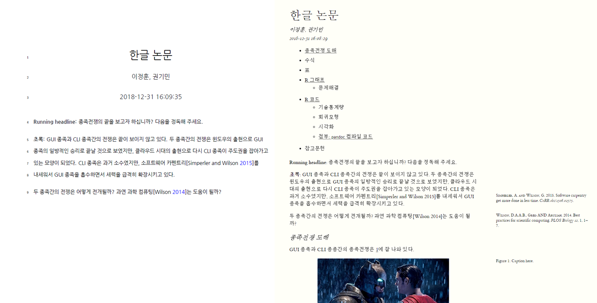

``` {r, include=FALSE}
# source("tools/chunk-options.R")
knitr::opts_chunk$set(echo = TRUE, warning=FALSE, message=FALSE,
                    comment="", digits = 3, tidy = FALSE, prompt = FALSE, fig.align = 'center')

```

# R 마크다운 + `make` 논문제작 자동화 {#automate-make-rmarkdown}

[Minimal make: A minimal tutorial on make](https://github.com/kbroman/minimal_make)를 바탕으로 영문논문 제작과정을 
R 마크다운에서 작업하도록 [Daijiang Li (2017/04/05, "Writing Academic Papers with Rmarkdown"](https://daijiang.name/en/2017/04/05/writing-academic-papers-with-rmarkdown/)에 
관련 내용이 상세히 정리되어 있다.

# 논문 자동화 작업흐름도 {#automate-make-rmarkdown-workflow}

`Makefile`을 중심으로 논문제작 자동화를 수행하고 
`doc\ms.Rmd` R 마크다운 파일에 참고문헌(`reference\`), 논문외양(`template\`)을 지정하고 
`R\` 디렉토리에 외부 데이터를 가져와서 분석하는 내용을 스크립트로 작성한다.

``` {r automate-paper-pdf, eval=FALSE}
# .\
#     Makefile
# └─doc
# │      ms.Rmd
# │      ms.pdf
# │      ms.html
# └─reference
#      acm-siggraph.csl
#      data_science.bib
# └─template
#      preamble.tex
#      doc_prefix.tex
# └─R
#      rcode.R
# │
# └─fig
#         gui-vs-cli.jpg
#         plot.pdf
# └─data
#        └─raw_data
#                     envi.csv
#                     under2012.csv
```


# 한글 논문 자동화 {#automate-make-rmarkdown-workflow-korean}

$\LaTeX$엔진이 `xelatex`이라 `pdflatex`을 기본으로 사용할 경우 다사다난한 한해를 보낼 수 있으니 주의한다.
$\LaTeX$엔진을 `xelatex`로 지정한 경우 `\usepackage{kotex}`을 반듯이 `preamble.tex`에 넣어 문제가 생기지 않도록 조치도 취한다. 다음은 수정된 `preamble.tex` 파일을 나타내고 있다.

``` {r automate-paper-pdf-korean, eval=FALSE}
\usepackage{geometry}
\geometry{verbose,letterpaper,margin=2.45cm}

% \usepackage[breaklinks=true,pdfstartview=FitH,citecolor=blue]{hyperref}
\hypersetup{colorlinks,%
  citecolor=blue,%
  filecolor=red,%
  linkcolor=blue,%
  urlcolor=red,%
  pdfstartview=FitH}

\usepackage{kotex}
\usepackage{booktabs}

\usepackage{setspace}
\doublespacing

% \setstretch{1.8999999999999999}

\usepackage{lineno}
\linenumbers

% \renewcommand{\rmdefault}{cmr}


% flush left while keep identation
\makeatletter
\newcommand\iraggedright{%
  \let\\\@centercr\@rightskip\@flushglue \rightskip\@rightskip
  \leftskip\z@skip}
\makeatother

% make pdf as default figure format
\DeclareGraphicsExtensions{.pdf,.png, %
    .jpg,.mps,.jpeg,.jbig2,.jb2,.JPG,.JPEG,.JBIG2,.JB2}
```

# 논문 자동화 결과물 {#automate-make-rmarkdown-workflow-output}

`word` 파일에 대해서 자동생성을 지정하지 않았기 때문에 PDF 파일과 HTML 문서만 자동으로 생성된다.




# `ms.Rmd` 원문 {#automate-make-rmarkdown-workflow-rmd}

YAML 헤더가 많이 복잡해지고 길어졌지만, 
앞선 출력형식 지정, 참고문헌 지정, 한글 설정과 관련하여 $\LateX$ 엔진을 변경사항을 반영시킨 것이다.
그외 논문에 필수적인 표와 그림의 참조 사항을 다양한 사례를 반영하여 지정하였고, 
가장 중요한 사항은 외부에서 데이터를 불러와서 이를 R 스크립트로 처리한 결과를 반영시킨 부분에 의미를 둘 수 있다. 

``` {r automate-paper-pdf-rmd, eval=FALSE}
#> ---
#> title: "한글 논문"
#> author: "이정훈, 권기민"
#> date: '`r format(Sys.time())`'
#> output:
#>   bookdown::pdf_document2:
#>     includes:
#>       before_body: ../template/doc_prefix.tex
#>       in_header: ../template/preamble.tex
#>     keep_tex: yes
#>     latex_engine: xelatex
#>     number_sections: no
#>     toc: no
#>   bookdown::html_document2:
#>     number_sections: no
#>     theme: readable
#>     toc: yes
#>   bookdown::tufte_html2:
#>     number_sections: no
#>     toc: yes
#>   bookdown::word_document2: null
#> fontsize: 12pt
#> linestretch: 1.5
#> link-citations: yes
#> bibliography: "../reference/data_science.bib"
#> csl: "../reference/acm-siggraph.csl"
#> mainfont: NanumGothic
#> ---
#> 
#> ```{r knitr_options, echo=FALSE}
#> library(knitr)
#> # rstudio will set the folder where .Rmd file seats as work directory
#> # set it back to the folder where .Rproj seats
#> opts_knit$set(root.dir = normalizePath("../")) 
#> opts_chunk$set(fig.align='center', cache=F, warning = FALSE, message = T, echo = FALSE)
#> options(digits = 3, width = 88)
#> 
#> # download template files if not available
#> # tpl_1 <- 'https://raw.githubusercontent.com/statkclee/author_carpentry_kr/gh-pages/tutorial/05_rstudio_rmarkdown_paper/template/preamble.tex'
#> # tpl_2 <- 'https://raw.githubusercontent.com/statkclee/author_carpentry_kr/gh-pages/tutorial/05_rstudio_rmarkdown_paper/template/doc_prefix.tex'
#> # bib_1 = 'https://raw.githubusercontent.com/daijiang/workflow_demo/master/template/ref.bib'
#> # change directory accordingly
#> # if(!file.exists(tpl_1f <- '../template/preamble.tex')) download.file(tpl_1, tpl_1f)
#> # if(!file.exists(tpl_2f <- '../template/doc_prefix.tex')) download.file(tpl_2, tpl_2f)
#> ```
#> 
#> **Running headline**: 종족전쟁의 끝을 보고자 하십니까? 다음을 정독해 주세요.
#> 
#> **초록**: GUI 종족과 CLI 종족간의 전쟁은 끝이 보이지 않고 있다.
#> 두 종족간의 전쟁은 윈도우의 출현으로 GUI 종족의 일방적인 승리로 끝날 것으로 보였지만, 클라우드 시대의 출현으로 다시 CLI 종족이 주도권을 잡아가고 있는 모양이 되었다.
#> CLI 종족은 과거 소수였지만, 소프트웨어 카펜트리[@DBLP:journals/corr/SimperlerW15]를 내세워서 GUI 종족을 흡수하면서 세력을 급격히 확장시키고 있다.
#> 
#> 두 종족간의 전쟁은 어떻게 전개될까? 과연 과학 컴퓨팅[@10.1371/journal.pbio.1001745]는 도움이 될까?
#> 
#> \clearpage
#> 
#> ## 종족전쟁 도해
#> 
#> GUI 종족과 CLI 종종간의 종족전쟁은 \@ref(fig:supermanBatman)에 잘 나와 있다.
#> 
#> ```{r supermanBatman, out.width='70%', fig.cap="Caption here."}
#> knitr::include_graphics(path = paste0(normalizePath(getwd()), "/fig/gui-vs-cli.jpg"))
#> ```
#> 
#> ## 수식
#> 
#> $$\text{생산성} = \frac{\text{CLI}^2}{\text{GUI}}$$
#> 
#> ## 표
#> 
#> 
#> ```{r tableName,results='asis',echo=FALSE, message=F, warning=F}
#> source("R/rcode.R")
#> knitr::kable(sprich, booktabs = T, caption = "Caption here.")
#> ```
#> 
#> 종족 평균값은 `r meansprich`.
#> 
#> 표 참조를 넣은 경우 \ref{t:anova}:
#> 
#> ```{r echo=F,results='asis',warning=F,message=F}
#> library(xtable)
#> envi.summ = xtable(summary(envi.aov),label = "t:anova", caption = "Caption here")
#> print(envi.summ,
#>     caption.placement = "top",
#>     floating=T,
#>     hline.after=NULL,
#>     comment = FALSE,
#>     add.to.row=list(pos=list(-1,0, nrow(envi.summ)),
#>     command=c(
#>        '\\toprule\n',
#>       '\\midrule\n',
#>        '\\bottomrule\n')))
#> ```
#> 
#> 
#> 
#> 
#> 
#> 수작업으로 표를 넣는 경우 \@ref(tab:byhand):
#> 
#> Table: (#tab:byhand) Caption here.
#> 
#> Col A             Col B       Col C                   Col D
#> ------------      -------     ------------------      ------------------
#> row 1             190         $112 \pm 2$             $233 \pm 3$
#> $\eta$            0.13        0.12                    0.12
#> $\eta^2$          0.14        0.13                    0.50
#> $\eta^3$          0.15        0.31                    0.52
#> 
#> 
#> # R 그래프 
#> 
#> 그래프 참조를 하는 방법 \@ref(fig:figName).
#> 
#> ```{r figName, fig.width=7, fig.asp=1, fig.cap="Your caption here."}
#> ggplot(data = envi.sprich, aes(x = value, y = sprich)) +
#>   geom_point() + geom_smooth(method = "lm") +
#>   facet_wrap(~envi, scales = "free_x") + theme_bw()
#> ```
#> 
#> 
#> ## 문제해결 
#> 
#> GUI로 해결하기 힘든 아래와 같이 `pdf` 파일 생성시 생긴 문제는 
#> 구글 검색을 통해서 stackoverflow [Pandoc and foreign characters](https://stackoverflow.com/questions/18178084/pandoc-and-foreign-characters)에서
#> 해법을 찾아 `--latex-engine=xelatex -V CJKmainfont=NanumGothic`와 같이 글꼴까지 반영시킨다.
#> 
#> ```
#> ! Package inputenc Error: Unicode character 내 (U+B0B4)
#> (inputenc)                not set up for use with LaTeX.
#> ```
#> 
#> # R 코드 
#> 
#> ## 기술통계량
#> 
#> ```{r sample}
#> suppressMessages(library(tidyverse))
#> summary(mtcars[,1:5])
#> ```
#> 
#> ## 회귀모형
#> 
#> ```{r sample-reg}
#> mtcars_reg <- lm(mpg ~ disp, data=mtcars)
#> 
#> mtcars_reg %>% broom::tidy()
#> ```
#> 
#> ## 시각화 
#> 
#> ```{r mtcarsGraph, fig.width=7, fig.asp=1, fig.cap="Mtcars 그래프"}
#> mtcars %>% 
#>   mutate(vs = as.factor(vs)) %>% 
#>   ggplot(aes(x=disp, y=mpg, color=vs)) +
#>     geom_point() +
#>     geom_smooth(method = "lm") +
#>     theme_minimal()
#> ```
#> 
#> ## 첨부: `pandoc` 컴파일 코드
#> 
#> ```{r pandoc-code, eval=FALSE}
#> pandoc --filter pandoc-citeproc 
#>        --bibliography=data_science.bib 
#>        --variable classoption=twocolumn 
#>        --variable papersize=a4paper 
#>        --latex-engine=xelatex 
#>        -V CJKmainfont=NanumGothic 
#>        -s data_science.md -o data_science.pdf
#> ```
#> 
#> # 참고문헌
```