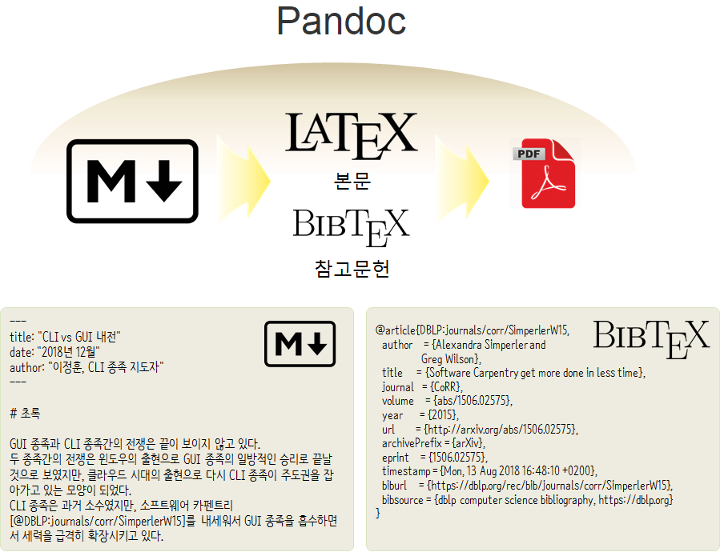

``` {r, include=FALSE}
# source("tools/chunk-options.R")
knitr::opts_chunk$set(echo = TRUE, warning=FALSE, message=FALSE,
                    comment="", digits = 3, tidy = FALSE, prompt = FALSE, fig.align = 'center')

```


# 마크다운 &rarr; $LaTeX$ 논문작성 [^latex-bib-pdf] {#latex-paper}

[^latex-bib-pdf]: [How to make a scientific looking PDF from markdown (with bibliography)](https://gist.github.com/maxogden/97190db73ac19fc6c1d9beee1a6e4fc8)

마크다운으로 논문을 저작하는 기본적인 흐름은 다음과 같다.
마크다운으로 논문을 저작하고 팬독(pandoc) 도구를 사용해서 $LaTeX$으로 변환시킨 후에 `pdf` 파일을 뽑아내는 것이다.
논문은 참고문헌(Bibliography)을 갖는다는 점에서 다른 문서들과 차이점이 있다.
이를 반영하기 위해서 [`BibTeX`](http://faq.ktug.org/faq/BibTeX)이 아주 오래전에 개발되어 많이 활용되고 있다.
BibTeX 프로그램(bibtex)은 참고문헌 데이터베이스(.bib 파일)에서 필요한 목록을 뽑아, 
참고문헌 목록 서식(BSTFile)에 따라 자동으로 참고문헌 목록을 생성하기 위한 프로그램이다.
이에 대응되는 pandoc 프로그램이 [pandoc-citeproc](https://github.com/jgm/pandoc-citeproc)이다. 



# 논문제작 도구 설치 {#latex-paper-toolchain}

`$LaTeX$`이 설치되어 있다는 가정하에 추가로 설치해야 되는 도구는 `pandoc`, `pandoc-citeproc`이다.

맥에서는 `brew install pandoc pandoc-citeproc` 명령어로 설치하면 되고 윈도우에서는 `pandoc`을 설치하면 포함되어 자동 설치되는 것으로 알려져 있다.
RStudio에도 `pandoc`이 내장되어 있고, `C:\Program Files\RStudio\bin\pandoc` 디렉토리에 `pandoc.exe`, `pandoc-citeproc.exe` 파일이 모두 내장되어 있다.

# 작업흐름(workflow) {#latex-paper-toolchain}

도구가 설치되면 공장으로 치면 설비가 깔린 것과 다름없다.
그 다음 단계로 논문 제작 공장 설비에 마크다운 문서를 올리면 최종 산출물로 PDF 파일 제품이 나오는 것과 유사하다.
이를 위해서 먼저 원재료를 두개 준비한다. 하나는 논문 원본이고 다른 하나는 참고문헌 데이터베이스다. 
이를 `pandoc`에 넣고 일부 선택옵션을 맞춰 놓게 되면 원하는 제품 PDF 파일을 얻을 수 있다.

마크다운 &rarr; $LateX$ &rarr; $LateX$ Citeproc Bibliography Filter &rarr; PDF

# 논문제작 환경 {#latex-paper-project}

마크다운으로 `data_science.md` 파일을 작성한다. 그리고 나서 참고문헌은 `data_science.bib` 파일에 작성한다.
이미지는 `fig` 디렉토리 아래 모아둔다. 이를 `pandoc` 프로그램을 실행시켜 `pdf` 파일을 생성시킨다.

``` {r latex-paper-structure, eval=FALSE}
# .\
# │  data_science.bib
# │  data_science.md
# │  data_science.pdf
# │
# └─fig
#         gui-vs-cli.jpg
```

참고문헌 `data_science.bib` 파일에 포함되어 있는 논문 두개는 다음 사이트에서 `BibTeX` 파일을 다운로드 받아 
텍스트 편집기로 열어서 원문 그대로 복사하여 붙여넣은 것이다.

- [Alexandra Simperler, Greg Wilson, Software Carpentry get more done in less time](https://arxiv.org/abs/1506.02575)
- [Greg Wilson , D. A. Aruliah, C. Titus Brown, Neil P. Chue Hong, Matt Davis, Richard T. Guy, Steven H. D. Haddock, Kathryn D. Huff, Ian M. Mitchell, Mark D. Plumbley, Ben Waugh, Ethan P. White, Paul Wilson, "Best Practices for Scientific Computing"](https://journals.plos.org/plosbiology/article?id=10.1371/journal.pbio.1001745)

<div class = "row">
  <div class = "col-md-6">
**`data_science.md`**

``` {r data-science-md, eval=FALSE}
# ---
# title: "CLI vs GUI 내전"
# date: "2018년 12월"
# author: "이정훈, CLI 종족 지도자"
# ---
# 
# # 초록
# 
# GUI 종족과 CLI 종족간의 전쟁은 끝이 보이지 않고 있다.
# 두 종족간의 전쟁은 윈도우의 출현으로 GUI 종족의 일방적인 승리로 끝날 것으로 # 보였지만, 클라우드 시대의 출현으로 다시 CLI 종족이 주도권을 잡아가고 있는 모양이 # 되었다.
# CLI 종족은 과거 소수였지만, 소프트웨어 카펜트리[@DBLP:journals/corr/SimperlerW15]를 # 내세워서 GUI 종족을 흡수하면서 세력을 급격히 확장시키고 있다.
# 
# 두 종족간의 전쟁은 어떻게 전개될까? 과연 과학 # 컴퓨팅[@10.1371/journal.pbio.1001745]는 도움이 될까?
# 
# # 종족전쟁 도해
# 
# 
# 
# # 수식
# 
# $$\text{생산성} = \frac{\text{CLI}^2}{\text{GUI}}$$
# 
# # 문제해결 
# 
# GUI로 해결하기 힘든 아래와 같이 `pdf` 파일 생성시 생긴 문제는 
# 구글 검색을 통해서 stackoverflow [Pandoc and foreign # characters](https://stackoverflow.com/questions/18178084/pandoc-and-foreign-charact# ers)에서
# 해법을 찾아 `--latex-engine=xelatex -V CJKmainfont=NanumGothic`와 같이 글꼴까지 # 반영시킨다.
# 
# ```
# ! Package inputenc Error: Unicode character 내 (U+B0B4)
# (inputenc)                not set up for use with LaTeX.
# ```
# 
# # 참고문헌
# 
# # 첨부: `pandoc` 컴파일 코드
# 
# ```
# pandoc --filter pandoc-citeproc 
#        --bibliography=data_science.bib 
#        --variable classoption=twocolumn 
#        --variable papersize=a4paper 
#        --latex-engine=xelatex 
#        -V CJKmainfont=NanumGothic 
#        -s data_science.md -o data_science.pdf
```

</div>
  <div class = "col-md-6">
**`data_science.bib`**

``` {r data-science-bibtex, eval=FALSE}
# @article{DBLP:journals/corr/SimperlerW15,
#   author    = {Alexandra Simperler and
#                Greg Wilson},
#   title     = {Software Carpentry get more done in less time},
#   journal   = {CoRR},
#   volume    = {abs/1506.02575},
#   year      = {2015},
#   url       = {http://arxiv.org/abs/1506.02575},
#   archivePrefix = {arXiv},
#   eprint    = {1506.02575},
#   timestamp = {Mon, 13 Aug 2018 16:48:10 +0200},
#   biburl    = {https://dblp.org/rec/bib/journals/corr/SimperlerW15},
#   bibsource = {dblp computer science bibliography, https://dblp.org}
# }
# 
# @article{10.1371/journal.pbio.1001745,
#     author = {Wilson, Greg AND Aruliah, D. A. AND Brown, C. Titus AND Chue Hong, # Neil P. AND Davis, Matt AND Guy, Richard T. AND Haddock, Steven H. D. AND Huff, # Kathryn D. AND Mitchell, Ian M. AND Plumbley, Mark D. AND Waugh, Ben AND White, # Ethan P. AND Wilson, Paul},
#     journal = {PLOS Biology},
#     publisher = {Public Library of Science},
#     title = {Best Practices for Scientific Computing},
#     year = {2014},
#     month = {01},
#     volume = {12},
#     url = {https://doi.org/10.1371/journal.pbio.1001745},
#     pages = {1-7},
#     abstract = {We describe a set of best practices for scientific software # development, based on research and experience, that will improve scientists' # productivity and the reliability of their software.},
#     number = {1},
#     doi = {10.1371/journal.pbio.1001745}
# }
# 
```
  </div>
</div>


# 논문 생산 {#latex-paper-production}

논문 생산을 위한 모든 준비가 완료되었기 때문에 다음 단계로 마크다운 문서와 참고문헌을 넣고 한글이 깨지지 않도록 $LaTeX$ 엔진 설정을 바꿔서 넣게 되면 
PDF 논문이 생산된다.


``` {r data-science-pandoc, eval=FALSE}
# pandoc --filter pandoc-citeproc         # 참고문헌 데이터베이스 참고문헌으로 양식에 # 맞춰 변환
#        --bibliography=data_science.bib  # 참고문헌 데이터베이스 파일 
#        --variable classoption=twocolumn # 칼럼을 2개로 지정
#        --variable papersize=a4paper     # A4용지 맞춤
#        --latex-engine=xelatex           # 한글이 깨지는 문제로 다국어 지원되는 # `xelatex` 엔진 지정
#        -V CJKmainfont=NanumGothic       # 한글 폰드로 나눔고딕 설정
#        -s data_science.md               # 마크다운 논문 지정
#        -o data_science.pdf              # 출력 파일로 PDF 파일 지정
```

# 논문 PDF 제품 {#latex-paper-pdf}

상기 명령어를 쉘에서 실행시켜 나온 최종 산출물 PDF 파일을 검토한다.


