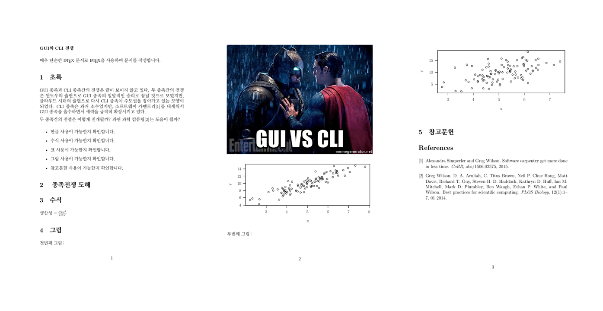

``` {r, include=FALSE}
# source("tools/chunk-options.R")
knitr::opts_chunk$set(echo = TRUE, warning=FALSE, message=FALSE,
                    comment="", digits = 3, tidy = FALSE, prompt = FALSE, fig.align = 'center')

```

# `make` 기반 논문제작 {#minimal-make}

[Minimal make: A minimal tutorial on make](https://github.com/kbroman/minimal_make)를 바탕으로 한글 논문 제작이 가능하도록 관련된 논문 제작 흐름을 
$\LaTeX$기반으로 살펴본다.

한국어 문제를 반영한 [minimal make korean](https://github.com/statkclee/author_carpentry_kr/tree/gh-pages/tutorial/06_minimal_make/ex1) 저장소에서 본 논문 관련 사항을 참조하면 실습에 도움이 될 수 있다.

# `make` 기반 논문 제작 흐름도 {#minimal-make-workflow}

`data_science.tex` 파일에 논문 제작의 핵심 내용을 작성한다.
그리고 나서 그림 제작에 해당되는 내용은 `fig1.R`, `fig2.R` 그래프를 생성시키는 프로그램 코드를 별도록 작성한다.
물론 참고문헌에 관련된 사항은 `data_science.bib` 데이터베이스를 활용한다.

``` {r make-paper-structure-pdf, eval=FALSE}
# .\
# │  data_science.tex
# │  data_science.bib
# │  data_science.pdf
# │  Makefile
# └─R
#      fig1.R
#      fig2.R
# │
# │
# └─fig
#         gui-vs-cli.jpg
#         fig1.pdf
#         fig2.pdf
```

# `make data_science` &rarr; data_science_pdf  {#minimal-make-workflow-pdf}

`Makefile`에 `paper`를 인자로 넘기게 되면 자동으로 논문을 제작하게 된다. 
과정에서 `pdflatex` 대신에 `xelatex`을 사용하고 그림을 변경하고자하는 경우도 `Makefile`에 
반영시킨다.

``` {r make-paper-structure-run, eval=FALSE}
paper: data_science.bib data_science.tex fig/fig1.pdf fig/fig2.pdf
  xelatex data_science.tex
  bibtex data_science.aux
  xelatex data_science.tex
  evince data_science.pdf

fig/fig1.pdf: R/fig1.R
  cd R; R CMD BATCH fig1.R

fig/fig2.pdf: R/fig2.R
  cd R; R CMD BATCH fig2.R
```

# `data_science.tex` 원문  {#minimal-make-workflow-latex}

``` {r make-paper-structure-latex, eval=FALSE}
# \documentclass[12pt]{article}
# \usepackage{kotex}
# \usepackage{graphicx}
# \setlength{\parskip}{6pt}   % 단락사이 빈여백 공간설정.
# \setlength{\parindent}{0pt} % 단락사이 들여쓰기 않함.
# 
# \begin{document}
# 
# \textbf{GUI와 CLI 전쟁}
# 
# \bigskip
# 
# 매우 단순한 \LaTeX\/ 문서로 \LaTeX\/을 사용하여 문서를 작성합니다.
# 
# \section{초록}
# 
# GUI 종족과 CLI 종족간의 전쟁은 끝이 보이지 않고 있다.
# 두 종족간의 전쟁은 윈도우의 출현으로 GUI 종족의 일방적인 승리로 끝날 것으로 보였지만, 클라우드 시대의 출현으로 다시 CLI 종족이 주도권을 잡아가고 있는 모양이 되었다.
# CLI 종족은 과거 소수였지만, 소프트웨어 카펜트리\cite{DBLP:journals/corr/SimperlerW15}를 내세워서 GUI 종족을 흡수하면서 세력을 급격히 확장시키고 있다.
# 
# 두 종족간의 전쟁은 어떻게 전개될까? 과연 과학 컴퓨팅\cite{10.1371/journal.pbio.1001745}는 도움이 될까?
# 
# \begin{itemize}
#   \item 한글 사용이 가능한지 확인합니다.
#   \item 수식 사용이 가능한지 확인합니다.
#   \item 표 사용이 가능한지 확인합니다.
#   \item 그림 사용이 가능한지 확인합니다.
#   \item 참고문헌 사용이 가능한지 확인합니다.
# \end{itemize}
# 
# 
# \section{ 종족전쟁 도해}
# 
# \begin{figure} [!htb]
#   \centerline{\includegraphics[width=\textwidth]{fig/gui-vs-cli.jpg}}
# \end{figure}
# 
# \section{수식}
# 
# $생산성 = \frac{CLI^2}{GUI}$
# 
# \section{그림}
# 
# 첫번째 그림:
# 
# \centerline{\includegraphics[width=\textwidth]{fig/fig1.pdf}}
# 
# 두번째 그림:
# 
# \centerline{\includegraphics[width=\textwidth]{fig/fig2.pdf}}
# 
# \section{참고문헌}
# 
# % Insert bibliography
# \bibliography{data_science}{}
# \bibliographystyle{plain}
# 
# \end{document}
```

# 출력 PDF 파일  {#minimal-make-workflow-latex-pdf}

