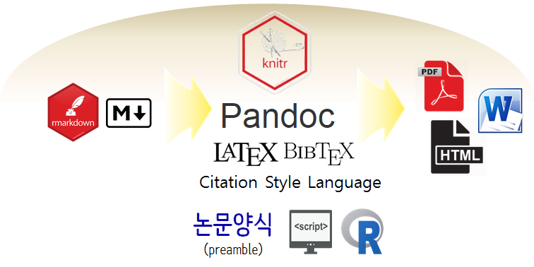
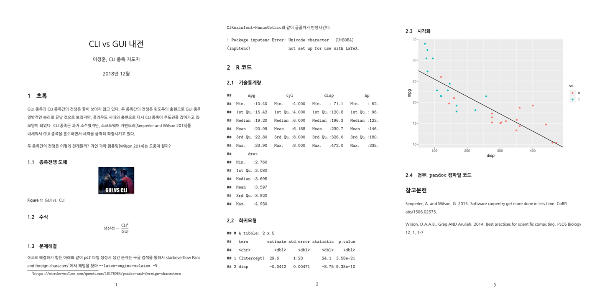

``` {r, include=FALSE}
# source("tools/chunk-options.R")
knitr::opts_chunk$set(echo = TRUE, warning=FALSE, message=FALSE,
                    comment="", digits = 3, tidy = FALSE, prompt = FALSE, fig.align = 'center')

```

# R 마크다운 &rarr; 논문 {#rmarkdown-paper}

R마크다운으로 논문을 저작하는 기본적인 흐름은 다음과 같다.
RStudio IDE와 같은 통합개발환경을 사용하여 `.Rmd` 파일 즉 `R script` + `markdown`를 담아 
`pandoc`, $LaTeX$ 엔진의 도움을 받아 [`BibTeX`](http://faq.ktug.org/faq/BibTeX), [CSL](http://citationstyles.org) 등을 활용하여 
보고서와 같은 저작물을 작성해 나가는 과정까지는 [R 마크다운 보고서](rmarkdown-authoring.html)와 동일하고 차이점이 있다면 
`in_header: "template/preamble.tex"`을 설정하여 마크다운 콘텐츠 내용을 논문 양식에 맞춰 변환시키는 과정이 포함된다.
추가로 RStudio IDE에서 굳이 논문제작 작업을 하는 이유는 데이터 분석 결과를 논문에 제현가능하게 반영시키고자 하는 부분이 크다.




# R 마크다운 논문 작업흐름도 {#rmarkdown-paper-code}

[Daijiang Li, (2017/04/05), "Writing Academic Papers with Rmarkdown"](https://daijiang.name/en/2017/04/05/writing-academic-papers-with-rmarkdown/) 블로그 내용을 참고했으며 
`make`를 사용하지 않고 RStudio에서 논문을 생성할 수 있도록 작업을 만들었다. 
이런 방식으로 작업하게 되면 작은 규모의 논문 작성은 가능하나 규모가 크고 복잡하고 R 코드와 참조가 많은 경우 확장성에 문제가 있는 것은 물론이다.

1. YAML 헤더에 `preamble.tex` 파일 설정 및 논문 제작에 필요한 사항을 정리한다.
1. `mtcars` 데이터셋을 기반으로 기술통계량, 회귀모형, 시각화에 대한 R 코드를 작성하여 반영시킨다.
1. RStudio IDE에서 뜨게질(`knitr`) 버튼을 눌러 컴파일시켜 PDF 파일을 얻는다.

`data_science.Rmd` 파일을 중심으로 `data_science.pdf`, `data_science.html` 파일은 자동 생성되고,
`template\`과 `reference\` 디렉토리에 논문 외양 양식과 참고문헌 관련 내용을 정리하여 따로 정리시킨다.

``` {r rmarkdown-paper-structure-pdf, eval=FALSE}
# .\
# │  data_science.Rmd
# │  data_science.pdf
# │  data_science.html
# └─template
#              doc_prefix.tex
#              preamble.tex
# └─reference
#               data_science.bib
#               acm-siggraph.csl
# │
# │
# └─fig
#         gui-vs-cli.jpg
```


# R 마크다운 논문 코드 {#rmarkdown-paper-code}

``` {r markdown-paper-code, eval=FALSE}
# ---
# title: "CLI vs GUI 내전"
# date: "2018년 12월"
# author: "이정훈, CLI 종족 지도자"
# output: 
#   bookdown::pdf_document2:
#     includes:
#       before_body: "template/doc_prefix.tex"
#       in_header: "template/preamble.tex"
#     keep_tex: yes
#     latex_engine: xelatex
#     number_sections: yes
#     toc: no
#   bookdown::html_document2:
#     number_sections: no
#     theme: readable
#     toc: yes
#   bookdown::tufte_html2:
#     number_sections: no
#     toc: yes
#   bookdown::word_document2: null
# fontsize: 12pt
# linestretch: 1.5
# link-citations: yes
# bibliography: "reference/data_science.bib"
# csl: "reference/acm-siggraph.csl"
# mainfont: NanumGothic
# editor_options: 
#   chunk_output_type: console
# ---
# 
# ```{r setup, include=FALSE}
# knitr::opts_chunk$set(echo = TRUE)
# 
# # download template files if not available
# tpl_1 <- 'https://raw.githubusercontent.com/daijiang/workflow_demo/master/template/preamble.tex'
# tpl_2 <- 'https://raw.githubusercontent.com/daijiang/workflow_demo/master/template/doc_prefix.tex'
# # bib_1 <- 'https://raw.githubusercontent.com/daijiang/workflow_demo/master/template/ref.bib'
# # change directory accordingly
# if(!file.exists(tpl_1f <- 'template/preamble.tex')) download.file(tpl_1, tpl_1f)
# if(!file.exists(tpl_2f <- 'template/doc_prefix.tex')) download.file(tpl_2, tpl_2f)
# ```
# 
# 
# # 초록
# 
# GUI 종족과 CLI 종족간의 전쟁은 끝이 보이지 않고 있다.
# 두 종족간의 전쟁은 윈도우의 출현으로 GUI 종족의 일방적인 승리로 끝날 것으로 보였지만, 클라우드 시대의 출현으로 다시 CLI 종족이 주도권을 잡아가고 있는 모양이 되었다.
# CLI 종족은 과거 소수였지만, 소프트웨어 카펜트리[@DBLP:journals/corr/SimperlerW15]를 내세워서 GUI 종족을 흡수하면서 세력을 급격히 확장시키고 있다.
# 
# 두 종족간의 전쟁은 어떻게 전개될까? 과연 과학 컴퓨팅[@10.1371/journal.pbio.1001745]는 도움이 될까?
# 
# ## 종족전쟁 도해
# 
# \begin{figure} [!htb]
# \centerline{\includegraphics[width=0.2\textwidth]{fig/gui-vs-cli.jpg}}
# \caption{GUI vs. CLI}
# \end{figure}
# 
# ## 수식
# 
# $$\text{생산성} = \frac{\text{CLI}^2}{\text{GUI}}$$
# 
# ## 문제해결 
# 
# GUI로 해결하기 힘든 아래와 같이 `pdf` 파일 생성시 생긴 문제는 
# 구글 검색을 통해서 stackoverflow [Pandoc and foreign characters](https://stackoverflow.com/questions/18178084/pandoc-and-foreign-characters)에서
# 해법을 찾아 `--latex-engine=xelatex -V CJKmainfont=NanumGothic`와 같이 글꼴까지 반영시킨다.
# 
# ```
# ! Package inputenc Error: Unicode character 내 (U+B0B4)
# (inputenc)                not set up for use with LaTeX.
# ```
# 
# # R 코드 
# 
# ## 기술통계량
# 
# ```{r sample}
# suppressMessages(library(tidyverse))
# summary(mtcars[,1:5])
# ```
# 
# ## 회귀모형
# 
# ```{r sample-reg}
# mtcars_reg <- lm(mpg ~ disp, data=mtcars)
# 
# mtcars_reg %>% broom::tidy()
# ```
# 
# ## 시각화 
# 
# ```{r sample-viz}
# mtcars %>% 
#   mutate(vs = as.factor(vs)) %>% 
#   ggplot(aes(x=disp, y=mpg, color=vs)) +
#     geom_point() +
#     geom_abline(intercept = coef(mtcars_reg)[1], slope= coef(mtcars_reg)[2])
# ```
# 
# ## 첨부: `pandoc` 컴파일 코드
# 
# ```{r pandoc-code, eval=FALSE}
# pandoc --filter pandoc-citeproc 
#        --bibliography=data_science.bib 
#        --variable classoption=twocolumn 
#        --variable papersize=a4paper 
#        --latex-engine=xelatex 
#        -V CJKmainfont=NanumGothic 
#        -s data_science.md -o data_science.pdf
# ```
# 
# # 참고문헌
#  
```

# R 마크다운 논문 출력물 {#rmarkdown-paper-output}




