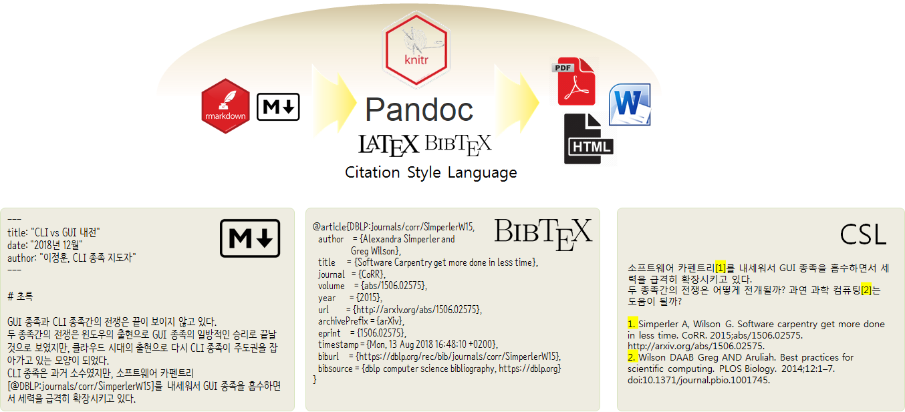
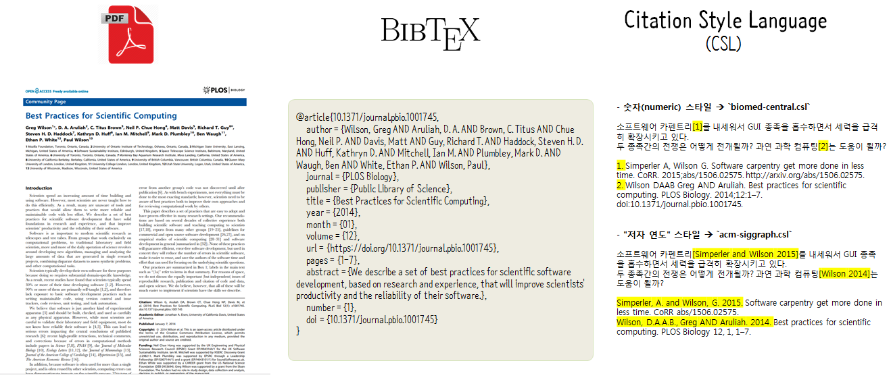

``` {r, include=FALSE}
# source("tools/chunk-options.R")
knitr::opts_chunk$set(echo = TRUE, warning=FALSE, message=FALSE,
                    comment="", digits = 3, tidy = FALSE, prompt = FALSE, fig.align = 'center')

```

# R 마크다운 &rarr; 보고서 {#rmarkdown-paper}

R마크다운으로 보고서를 저작하는 기본적인 흐름은 다음과 같다.
RStudio IDE와 같은 통합개발환경을 사용하여 `.Rmd` 파일 즉 `R script` + `markdown`를 담아 
`pandoc`, $LaTeX$ 엔진의 도움을 받아 [`BibTeX`](http://faq.ktug.org/faq/BibTeX), [CSL](http://citationstyles.org) 등을 활용하여 
보고서와 같은 저작물을 작성해 나간다.



## 참고문헌 {#bibliograph}

참고문헌은 [`BibTeX`](http://faq.ktug.org/faq/BibTeX)와 [CSL, Citation Style Language](http://docs.citationstyles.org/en/1.0.1/primer.html) 두가지로 구성된다.
즉, 참고문헌 데이터베이스 콘텐츠 자체와 이를 보고서에 스타일을 반영시키는 것으로 나눌 수 있다.
참고문헌 콘텐츠는 `.bib` 파일, 외양 스타일은 `.csl` 파일에 담기게 되고 `.Rmd` 파일 YAML 헤더에 `.bib`, `.csl` 파일이 위치한 곳을 지정하게 되면 이를 
참조하여 `.Rmd` 파일이 뜨게질(knit)할 때 자동으로 반영시킨다. 사례로 보고서를 작성하는 과정에서 
다음 두 **소프트웨어 카펜트리(Software Carpnetry)**에 관한 논문을 참고한다고 가정하다.

- [Alexandra Simperler, Greg Wilson, Software Carpentry get more done in less time](https://arxiv.org/abs/1506.02575)
- [Greg Wilson , D. A. Aruliah, C. Titus Brown, Neil P. Chue Hong, Matt Davis, Richard T. Guy, Steven H. D. Haddock, Kathryn D. Huff, Ian M. Mitchell, Mark D. Plumbley, Ben Waugh, Ethan P. White, Paul Wilson, "Best Practices for Scientific Computing"](https://journals.plos.org/plosbiology/article?id=10.1371/journal.pbio.1001745)

CSL(Citation Style Language)은 오픈XML기반의 프로그래밍언어로 인용 및 참고문헌 양식을 위해 개발되었고 
다수 상용 참고문헌 관리 프로그램 Zotero, Mendeley, Papers 등에 CSL이 채택되고 있다.
R 마크다운을 사용하면 굳이 상용 참고문헌 관리 프로그램을 사용할 필요가 없어진다.
참고로 `.csl` 스타일 양식 파일은 [http://citationstyles.org](http://citationstyles.org)이 운영하는 [Official repository for Citation Style Language (CSL) citation styles](https://github.com/citation-style-language/styles) 
GitHub 저장소에서 `.csl` 파일을 다운로드 받을 수 있다.



[CSL(Citation Style Language) - Documentation](http://docs.citationstyles.org/en/1.0.1/index.html) 문서에 따르면 크게 4가지 스타일이 존재한다.

- “author-date” & “author” Styles
- “numeric” Styles
- “numeric” Compound Styles
- “label” Styles

이중 "숫자(numeric) 스타일"과 "저자 연도(author-date) 스타일"을 살펴보자.


<div class = "row">
  <div class = "col-md-6">
**숫자(numeric) 스타일 사례 **

- `.csl` 스타일 파일: `biomed-central.csl`

- 본문:

소프트웨어 카펜트리[1]를 내세워서 GUI 종족을 흡수하면서 세력을 급격히 확장시키고 있다.
두 종족간의 전쟁은 어떻게 전개될까? 과연 과학 컴퓨팅[2]는 도움이 될까?

- 참고문헌: 

1. Simperler A, Wilson G. Software carpentry get more done in less time. CoRR. 2015;abs/1506.02575. http://arxiv.org/abs/1506.02575.
2. Wilson DAAB Greg AND Aruliah. Best practices for scientific computing. PLOS Biology. 2014;12:1–7. doi:10.1371/journal.pbio.1001745.

  </div>
  <div class = "col-md-6">
**"저자 연도" 스타일 사례 **

- `.csl` 스타일 파일: `acm-siggraph.csl`

- 본문:

소프트웨어 카펜트리[Simperler and Wilson 2015]를 내세워서 GUI 종족을 흡수하면서 세력을 급격히 확장시키고 있다.
두 종족간의 전쟁은 어떻게 전개될까? 과연 과학 컴퓨팅[Wilson 2014]는 도움이 될까?

- 참고문헌: 

Simperler, A. and Wilson, G. 2015. Software carpentry get more done in less time. CoRR abs/1506.02575.
Wilson, D.A.A.B., Greg AND Aruliah. 2014. Best practices for scientific computing. PLOS Biology 12, 1, 1–7.

  </div>
</div>


# 보고서 제작 환경 {#rmarkdown-paper-project}

마크다운으로 `data_science.Rmd` 파일을 작성한다. 
그리고 나서 참고문헌을 BibTeX 데이터베이스 `data_science.bib` 파일과 CSL 스타일 파일 `acm-siggraph.csl`을 
지정하여 다음과 같은 파일 구조를 만들어 둔다.
이미지는 `fig` 디렉토리 아래 모아둔다. 
R 마크다운 YAML 헤더에 `output: html_document`을 지정하면 
이를 `pandoc` 프로그램을 실행시켜 `html` 파일을 생성시킨다.

``` {r rmarkdown-paper-structure, eval=FALSE}
# .\
# │  data_science.bib
# │  acm-siggraph.csl
# │  data_science.Rmd
# │  data_science.pdf
# │  data_science.html
# │  data_science.docx
# │
# └─fig
#         gui-vs-cli.jpg
```

특히 PDF 파일을 생성시킬 때는 CJK 문화권의 2바이트 문자를 처리할 때 한글이 깨지는 경우가 있어 이에 대한 방비책으로 두가지를 수행해야 한다.
첫번째로 $LaTeX$엔진을 `xelatex`으로 설정해야 한다. 그러면 PDF 파일을 만들 수 있다. 
두번째로 PDF에 포함된 깨진 한글을 복구해야 하는데 이때 적절한 한글 폰트를 `mainfont`에 지정해주면 된다.
물론 `output: pdf_document` 지정하는 것을 잊으면 안된다. "CLI vs GUI 내전" 보고서를 작성하는데 사용된 YAML 헤더는 다음과 같다.

``` {r rmarkdown-yaml-header, eval=FALSE}
---
title: "CLI vs GUI 내전"
date: "2018년 12월"
author: "이정훈, CLI 종족 지도자"
output: 
  pdf_document:
    latex_engine: xelatex
mainfont: NanumGothic
bibliography: data_science.bib
csl: acm-siggraph.csl
---
```


# `.Rmd` 저작 파일 {#rmarkdown-authoring-rmd-file}

참고문헌이 자동 반영되도록 저작한 `data_science.Rmd` 파일 원문은 다음과 같다.
YAML 헤더에 관련된 설정을 모두 하고, 마크다운 문법에 맞춰 보고서를 작성한다. 사실
논문이라기 보다는 보고서에 가까운 형식이다. 

``` {r data-science-rmarkdown-source, eval=FALSE}
# ---
# title: "CLI vs GUI 내전"
# date: "2018년 12월"
# author: "이정훈, CLI 종족 지도자"
# output: 
#   pdf_document:
#     latex_engine: xelatex
# mainfont: NanumGothic
# bibliography: data_science.bib
# csl: acm-siggraph.csl
# ---
# 
# ```{r setup, include=FALSE}
# knitr::opts_chunk$set(echo = TRUE)
# ```
# 
# 
# # 초록
# 
# GUI 종족과 CLI 종족간의 전쟁은 끝이 보이지 않고 있다.
# 두 종족간의 전쟁은 윈도우의 출현으로 GUI 종족의 일방적인 승리로 끝날 것으로 보였지만, 클라우드 시대의 출현으로 다시 CLI 종족이 주도권을 잡아가고 있는 모양이 되었다.
# CLI 종족은 과거 소수였지만, 소프트웨어 카펜트리[@DBLP:journals/corr/SimperlerW15]를 내세워서 GUI 종족을 흡수하면서 세력을 급격히 확장시키고 있다.
# 
# 두 종족간의 전쟁은 어떻게 전개될까? 과연 과학 컴퓨팅[@10.1371/journal.pbio.1001745]는 도움이 될까?
# 
# ## 종족전쟁 도해
# 
# \begin{figure} [!htb]
# \centerline{\includegraphics[width=0.2\textwidth]{fig/gui-vs-cli.jpg}}
# \caption{GUI vs. CLI}
# \end{figure}
# 
# ## 수식
# 
# $$\text{생산성} = \frac{\text{CLI}^2}{\text{GUI}}$$
# 
# ## 문제해결 
# 
# GUI로 해결하기 힘든 아래와 같이 `pdf` 파일 생성시 생긴 문제는 
# 구글 검색을 통해서 stackoverflow [Pandoc and foreign characters](https://stackoverflow.com/questions/18178084/pandoc-and-foreign-characters)에서
# 해법을 찾아 `--latex-engine=xelatex -V CJKmainfont=NanumGothic`와 같이 글꼴까지 반영시킨다.
# 
# ```
# ! Package inputenc Error: Unicode character 내 (U+B0B4)
# (inputenc)                not set up for use with LaTeX.
# ```
# 
# ## 첨부: `pandoc` 컴파일 코드
# 
# ```{r pandoc-code, eval=FALSE}
# pandoc --filter pandoc-citeproc 
#        --bibliography=data_science.bib 
#        --variable classoption=twocolumn 
#        --variable papersize=a4paper 
#        --latex-engine=xelatex 
#        -V CJKmainfont=NanumGothic 
#        -s data_science.md -o data_science.pdf
# ```
# 
# # 참고문헌

```

# 보고서 PDF 제품 {#latex-paper-pdf}

`.Rmd`파일에 관련된 내용을 정성스럽게 준비해서 RStudio IDE에서 R마크다운 파일을 뜨게질(knit)하게 되면 PDF 파일이 바로 생성된다.
물론 워드, HTML 파일 등등 다양한 형태 문서로 자동 제작이 가능하다.

 
